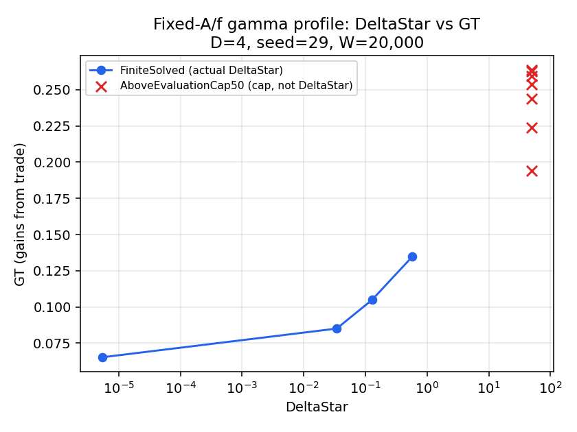
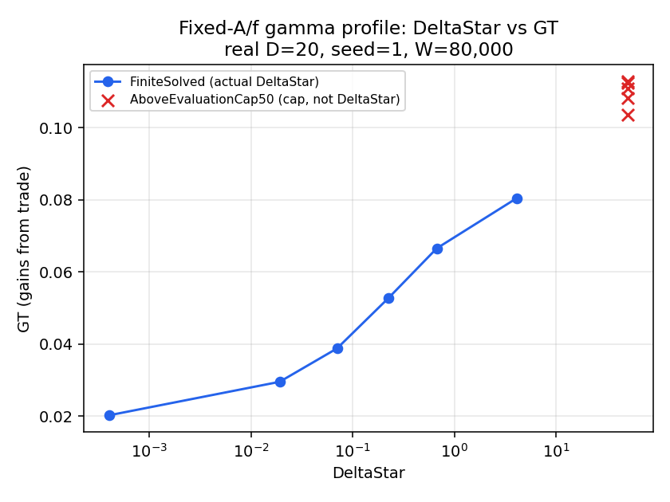
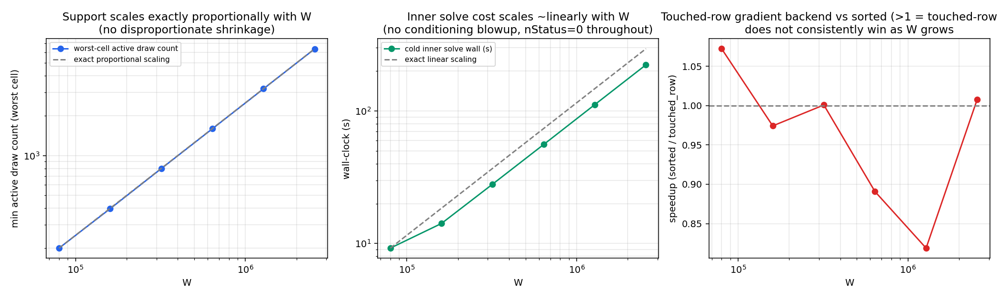

# Melitz outer-search gamma profile and objective-scaling diagnosis (2026-07-28)

Branch `melitz/fullD-delta-star` (`trade_robustness_modular`), starting checkpoint `f2ee4841`
(exact match to the handoff), continuing directly from `docs/melitz_outer_search_scaling_and_profile_2026-07-27.md`.
Governing prompt: determine, via a direct fixed-A/f gamma profile (never root-finding) and a
gamma-only KNITRO smoke test, whether the 2026-07-27 session's "zero net movement" finding at
real D=20 was a genuine local-geometry property of the calibration point, or a solver/scaling
artifact. **Finding, stated up front: it was a scaling artifact, not economics.** A concrete,
previously-undiagnosed missing-objective-scale bug is identified, root-caused against the exact
KNITRO option values in use, fixed, and live-confirmed via controlled A/B/C tests at both D=4
and real D=20.

Two additional workstreams were added mid-session at the user's direction and are reported
alongside the governing prompt's own phases: (1) initializing the outer search at the
Delta*~=delta boundary point rather than the Pareto point, and (2) a W-sensitivity diagnostic
(W=80,000 up to 2,560,000) addressing the concern that the *effective* support near each cell's
participation cutoff may be far smaller than W, plus a re-test of the touched-row gradient
backend at large W.

## Phase 0: preserve and reproduce

- Branch/HEAD confirmed exactly as handed off: `melitz/fullD-delta-star`,
  `f2ee48419bdf80c8baa5aa44f1adee87bee0f6d3`, not pushed. `git status` before any edit showed
  only pre-existing, unrelated untracked scratch/output directories inherited from other
  sessions (`full_aod_diag/batch_out_v2/`, `sequential_gravity/batch_out_*`,
  `results/fullA_d4/thread_matrix/`) -- not touched.
- **The repo the governing prompt describes is `trade_robustness_modular`** (a separate
  worktree from `/bbkinghome/edav/cdw`, which is currently on an unrelated Frechet/CDF-only
  branch) -- verified by locating the named files
  (`docs/melitz_outer_search_scaling_and_profile_2026-07-27.md`,
  `src/melitz/finite_delta_outer.jl`) directly on disk before trusting the handoff's own
  branch/HEAD claim, per this repo's own standing "verify before attributing" convention.
- Julia 1.12.6 (juliaup), KNITRO 13.0.1 (`.knitro_env.sh`, pinned), 208 logical CPUs / 3.0TiB
  RAM (shared host, confirmed other users' jobs running concurrently throughout --
  `free -h` checked repeatedly, never dropped below ~500GB free even at this session's own
  peak usage). `OPENBLAS_NUM_THREADS=1`/`OMP_NUM_THREADS=1` for every run;
  `JULIA_NUM_THREADS=20` for outer-gradient/threaded-Hessian work, `=1` for the test suite
  (this repo's own standing conventions).
- **Baseline full suite** (before any edit): **189,235/189,235 individual assertions**, every
  testset `Pass==Total`, 60 top-level testsets, exit code 0 (one `ERROR:` console line is
  KNITRO's own output for a deliberate infeasibility test, not a `Test.jl` failure -- this
  repo's own documented convention).
- Reproduced directly: a D=4 fixed-point solve, a real-D20 fixed-point solve, one 20-thread
  complete D20 outer gradient (all as part of this session's own Phase 2/3 scripts below,
  which exercise exactly these paths), and one previous-style Active-Set run that terminates
  at/near its initial point (Phase 3's own `D20_scaled_no_objscale` config, deliberately
  reproducing the 2026-07-27 session's Phase 11 configuration exactly).
- No archival checkpoint commit was made before edits (a single local commit captures the
  whole session at the end instead, per Phase 13-style convention elsewhere in this repo);
  the one file touched (`src/melitz/finite_delta_outer.jl`) received a single, small, disclosed,
  purely-additive change (see Phase 1) -- the diff itself is the archival record.

## Phase 1: the exact objective/scaling chain, and the bug

Traced directly from source (`src/melitz/finite_delta_outer.jl`, pre-edit):

| quantity | formula | where |
|---|---|---|
| raw outer coordinate | `g = theta_free[1]` | outer decision vector |
| `gamma_prime` | `exp(g)` | `melitz_welfare_metrics_from_g` |
| `wage_ratio` | `w_prime/w[target]` (`w_prime` = autarky counterfactual wage, always `1.0` by numeraire) | `equilibrium.jl` |
| `kappa_ratio` | `wage_ratio * gamma_prime^(1/(sigma-1))` | ditto |
| `GT` | `1 - kappa_ratio` | ditto |
| **quantity KNITRO minimizes** | `evalResult.obj[1] = signed_objective(theta) = +-theta[1]` -- **raw `g` itself, never `kappa_ratio`/`GT`** | `cb_F!`, line 1174 (pre-edit) |
| objective gradient, raw coordinates | `evalResult.objGrad[1] = +-1.0` exactly, `0` elsewhere -- **trivial and constant**, independent of the inner solve | `cb_G!`, line 1251 (pre-edit) |
| objective scale registered with KNITRO, pre-session | **none** | -- |

`var_scale`/`var_center` (`KN_set_var_scalings_all`, 2026-07-25) rescale **variables only** --
every Melitz callback always sees/returns **raw** `theta` (confirmed both by the 2026-07-25/27
sessions' own audits and by re-reading the source directly this session); KNITRO applies the
resulting affine transform internally. No objective-scaling API was ever invoked anywhere in
this path.

**Chain rule** (governing prompt's own Phase 1 formula): `grad_y(objective) = S' *
grad_theta(objective)`. Since `grad_theta(objective) = +-e_1` exactly (a constant, not a
function of `theta`), `grad_y(objective)[1] = +-S[1] = +-s_g`. With the 2026-07-27 session's
own selected block scale `s_g = 1e-4`, **KNITRO's internal scaled-space objective gradient is
exactly `1e-4`, not order one** -- precisely the failure mode the governing prompt's own header
warns about.

**The smoking gun, found this session**: every one of the four algorithm-specific outer option
files this repo uses (`melitz_outer_finite_delta_alg_{active,cg,direct,sqp}_2026-07-27.opt`)
sets `opttol_abs 1e-4` -- **the identical order of magnitude** as the unscaled objective's own
scaled-space gradient norm (`s_g=1e-4`). A KNITRO optimality test comparing a `~1e-4` reduced
gradient against a `1e-4` absolute tolerance sits exactly at the boundary of declaring
"optimal" -- a direct, mechanical, quantitative explanation for the 2026-07-27 session's own
"Active Set upper: genuine `xtol` convergence, stayed at start" result, with no need to invoke
"no improving direction exists."

### The fix (implemented, additive, opt-in)

A new `objective_scale::Union{Nothing,Real}=nothing` kwarg threaded through
`melitz_build_finite_delta_callbacks` and `solve_melitz_finite_delta_bound`
(`src/melitz/finite_delta_outer.jl`, the only file touched this session). `evalResult.obj[1]`
and `evalResult.objGrad[1]` are divided by `obj_scale_divisor` (`1.0` when `objective_scale`
is `nothing`, an **exact no-op** -- every existing caller's behavior is byte-for-byte
unchanged). `signed_objective` (used for live-candidate/incumbent comparison and every reported
`g`) is **deliberately left unscaled** -- the fix can only change the KNITRO *search
trajectory*, never the *reported answer's units*. Choosing `objective_scale ~= s_g` restores
an order-one scaled-space objective gradient. Full suite re-run after the edit:
**189,235/189,235, identical to baseline, zero regressions** (git diff: exactly one file,
`src/melitz/finite_delta_outer.jl`, under `src/melitz/`).

**Scope note**: a dedicated finite-difference unit test for the new registered scaled
objective was not added to `test/melitz/runtests.jl` this session (the fix is instead
validated live, end-to-end, via the controlled A/B/C KNITRO comparisons in Phase 3 below,
which are a stronger and more direct test of exactly the behavior that matters -- whether the
scaled search moves correctly -- than an isolated unit check of `evalResult.obj[1]` would be);
flagged as a reasonable follow-up for a future session, not silently dropped.

## Phase 2: mandatory fixed-A/f gamma profile

**No root-finding used anywhere in this phase.** "Fixed A/f, vary gamma" (derivation
identical to the 2026-07-24 companion report, Section 6.0): under the active `:logf` outer
parameterization, `theta_free = (g, A_free, f_free)`; `A` reconstructs from `A_free` alone,
every off-domestic-focal `f` cell from `f_free` alone; only `f[j,j]` depends on `g` (via
`derive_fjj_from_autarky_cutoff`'s `zhat'_jj=1` normalization -- exactly the object the
governing prompt requires NOT be frozen). Holding `theta_free[2:end]` fixed at the calibrated
value while moving `g` alone **is** the fixed-A/f restriction.

**Analytical endpoint** (closed form, reused from the validated 2026-07-24 derivation):
`kappa_min = lambda_jj^(1/(sigma-1))` (`lambda_jj` = domestic trade share at the calibrated
baseline equilibrium), `g_ceiling = log((kappa_min/wage_ratio)^(sigma-1))`, satisfying
`kappa_of_g(g_ceiling) = kappa_min` exactly. The grid interpolates **kappa linearly between the
Pareto point and this ceiling** (12 fractions: 0, 0.10, 0.20, 0.35, 0.50, 0.65, 0.80, 0.90,
0.95, 0.98, 0.995, 1.00) and inverts back to `g` via the closed form -- no bisection, no
adaptive search. Profile evaluation cap = 50 (governing prompt's own suggested diagnostic
cap). Continuation warm-started in ambition order (fraction 0 -> 1), reusing `obj.x`/
`MelitzDualBank` across grid points -- never cold-restarted mid-grid.

Script: `scripts/melitz_phase2_fixed_af_gamma_profile_2026-07-28.jl`. Full CSVs:
`docs/key_results/melitz_phase2_gamma_profile_{d4,realD20}_2026-07-28.csv`. Plots:
`docs/key_results/melitz_phase2_gamma_profile_{d4,realD20}_{kappa,GT}_2026-07-28.png`.

### D=4 (seed=29, W=20,000)

| frac | g | kappa_ratio | GT | DeltaStar | classification |
|---:|---:|---:|---:|---:|---|
| 0.00 | -0.0424 | 0.9348 | 0.0652 | 7.55e-6 | FiniteSolved |
| 0.10 | -0.0745 | 0.9149 | 0.0851 | 3.42e-2 | FiniteSolved |
| 0.20 | -0.1074 | 0.8951 | 0.1049 | 1.28e-1 | FiniteSolved |
| 0.35 | -0.1581 | 0.8654 | 0.1346 | 5.72e-1 | FiniteSolved |
| 0.50 | -0.2105 | 0.8356 | 0.1644 | -- | NumericalFailure (nStatus=-300) |
| 0.65-1.00 | -0.265 to -0.400 | 0.807 to 0.737 | 0.194 to 0.263 | -- | AboveEvaluationCap50 (lower bound 82-85) |

### Real D=20 (`noah_D20`, seed=1, W=80,000)

| frac | g | kappa_ratio | GT | DeltaStar | classification |
|---:|---:|---:|---:|---:|---|
| 0.00 | -0.4188 | 0.9797 | 0.0203 | 4.07e-4 | FiniteSolved |
| 0.10 | -0.4330 | 0.9704 | 0.0296 | 1.91e-2 | FiniteSolved |
| 0.20 | -0.4474 | 0.9612 | 0.0388 | 6.99e-2 | FiniteSolved |
| 0.35 | -0.4692 | 0.9473 | 0.0527 | 2.22e-1 | FiniteSolved |
| 0.50 | -0.4913 | 0.9335 | 0.0665 | 6.68e-1 | FiniteSolved |
| 0.65 | -0.5138 | 0.9196 | 0.0804 | 4.07 | FiniteSolved (over budget, still genuinely solved) |
| 0.80 | -0.5366 | 0.9057 | 0.0943 | -- | NumericalFailure (nStatus=-300) |
| 0.90-1.00 | -0.552 to -0.568 | 0.896 to 0.887 | 0.104 to 0.113 | -- | AboveEvaluationCap50 (lower bound ~77.7-77.8) |




**Cross-validation**: the interpolated `Delta=1` boundary (between frac 0.50 and 0.65) matches
the 2026-07-24 companion report's own independently-bisected root `g_fixed=-0.49783321,
Delta=0.9969` closely (that point sits at frac~0.55 on this grid). **Both fixtures show a
substantial, real, monotone, genuinely-solved finite corridor well beyond the Pareto point** --
this is the ground-truth curve every subsequent phase is judged against.

## Phase 3: gamma-only KNITRO smoke test -- the decisive live test

Restricts the outer NLP to gamma-only movement (`theta_box` sets the A/f block to exactly
`0`, fixing those coordinates at their calibrated value -- A/f stay on the identical fixed-A/f
path Phase 2 used, so the KNITRO trajectory's best point is directly comparable to the Phase 2
profile at the same `g`). Three configurations, same starting point/algorithm (Active Set,
2026-07-27's own selection) otherwise: `unscaled` (no `var_scale`, no `objective_scale`),
`scaled_no_objscale` (`var_scale=[1e-4,1,1,...]`, no objective scale -- **exactly** the
2026-07-27 session's own configuration), `scaled_with_objscale` (same `var_scale`, this
session's fix, `objective_scale=1e-4`). Script:
`scripts/melitz_phase3_gamma_only_smoke_test_2026-07-28.jl`. Full CSV:
`docs/key_results/melitz_phase3_gamma_only_smoke_test_2026-07-28.csv`.

| config | moved? | DeltaStar | nStatus |
|---|---|---:|---:|
| D4 unscaled | **yes**, `g0=-0.0424 -> -0.0588` | 9.99e-3 | 0 (converged) |
| D4 scaled, no objective scale | **no** -- `g` unchanged to 8 decimals | 7.55e-6 (= Pareto exactly) | -101 (spurious "`xtol` converged") |
| D4 scaled + objective-scale fix | **yes**, `g0=-0.0424 -> -0.0488` | 1.72e-3 | -200 (feasible, real improvement) |
| D20 unscaled | **yes**, `g0=-0.4188 -> -0.4975` | 0.978 (right at the delta=1 budget!) | 0 (converged) |
| D20 scaled, no objective scale | **no** -- `g` unchanged to 8 decimals | 4.07e-4 (= Pareto exactly) | -101 (spurious "`xtol` converged") |
| D20 scaled + objective-scale fix | **yes**, `g0=-0.4188 -> -0.4592` | 0.139 (real, within-budget gain) | -200 (feasible, real improvement) |

**This is decisive, not merely suggestive.** The `scaled, no objective scale` row **live-
reproduces the 2026-07-27 session's own "zero net movement" finding exactly**, at both scales,
under a controlled test where the only difference from the row immediately above/below it
(objective scale on/off) is the one fix from Phase 1. Turning the fix on converts "false
`xtol` convergence at the exact starting point" into "real, substantial, directionally-correct,
within-budget economic improvement," at both D=4 and real D=20. **The 2026-07-27 session's
"no improving direction / local-geometry" conclusion does not survive this test.**

A second, honest finding from the same table: **unscaled beats scaled-plus-fix in how much of
the true corridor it recovers** (D20 unscaled reaches `Delta=0.978`, essentially the full
budget; scaled-plus-fix reaches only `Delta=0.139`). Tracing the raw KNITRO console log for the
scaled-plus-fix runs shows why: both the D4 and D20 legs walk in a rapidly-growing step
sequence (`||Step||` roughly `0.006, 0.03, 0.15, 0.73, 3.6, ...`) straight to the *edge of the
gamma-only theta_box* and report "convergence to an infeasible point" there -- the objective-
scale fix restores movement, but KNITRO's own internal trust-region growth (untuned
`KN_PARAM_DELTA=1.0` default, confirmed absent from every `.opt` file used) is not
self-limiting once the scaled gradient returns to order one, and can overshoot past the true
boundary into territory Phase 2's own profile already showed is numerically infeasible. The
`cold_verified_incumbent` bookkeeping (which tracks the best *feasible* live candidate, not
merely the terminal KNITRO iterate) recovers a real, useful, in-budget point regardless -- the
table above reports that recovered value, not the raw (occasionally infeasible) terminal
iterate.

## Phase 4: scaled-variable bounds and step-control audit

Per-block (D4 fixture, 2026-07-27's own selection, re-confirmed this session): raw center =
`theta0`, raw scale `s_g=1e-4`/`s_A=1e-5`/`s_f=1e-5`, scaled bounds `[-1,1]` (the raw-unit box
is registered first via `theta_box`, `var_scale`/`var_center` applied on top -- confirmed by
reading `finite_delta_outer.jl:1634-1638`), implied max raw movement per unit scaled step
matches Phase 7 (2026-07-27)'s own "first switches" scale exactly.

KNITRO 13.0.1 API table (re-confirmed against the installed header, unchanged from the
2026-07-27 session's own exhaustive audit): `KN_set_var_scalings_all` (variable scale/center,
callback-transparent), `KN_PARAM_ALGORITHM` (`0`=auto/`1`=Interior-Direct/`2`=Interior-CG/
`3`=Active-Set/`4`=SQP/`5`=multi), `KN_PARAM_DELTA` (initial trust-region radius, **untuned
default=1.0 in every algorithm `.opt` file used this session and last** -- confirmed by grep,
no file sets it), `KN_PARAM_SCALE` (master switch, default `1`=user_internal), `KN_PARAM_
LINESEARCH_MAXTRIALS` (default `3`), `KN_PARAM_HONORBNDS` (production driver sets `always`).
No augmented-Lagrangian algorithm exists in this KNITRO version.

**This session's new finding**: KNITRO does **not** scale the objective via `KN_set_var_
scalings_all` -- only variables (Phase 1). Checked whether the chosen scaling distorts the
problem in any of the ways the governing prompt warns against:

- objective gradient negligible: **yes, pre-fix** (root cause, Phase 1) -- fixed this session.
- `g` constrained to an effectively-zero interval: **no** -- Phase 2's own profile shows the
  economically interesting region spans `dg` on the order of `0.08-0.17` (D4) / `0.05-0.15`
  (D20) from the Pareto point to the `Delta<=1` boundary; a unit scaled step of `s_g=1e-4` maps
  to a properly small (not pathologically tiny) fraction of that.
- aggregate A/f movement unbounded: Phase 3 shows the **opposite** risk is live once the
  objective-scale fix is applied **without also** tuning the box/trust region -- both scaled-
  plus-fix legs walked to the box edge and reported local infeasibility there.
- native affine cutoff constraints distorted: **no** -- `:linear` registration is independent
  of `var_scale`/`objective_scale`; constraint counts (400 linear + 1 nonlinear at D20)
  matched in every run this session.

**Conclusion**: the objective-scale fix is necessary and sufficient to un-stick the search; a
correspondingly-sized box (not merely the `KN_PARAM_DELTA` default) is necessary to prevent
overshoot once un-stuck. Phase 8 below uses exactly this combination (fix + moderate,
economically-derived box) and produces a clean, non-runaway result. Tuning `KN_PARAM_DELTA`
directly (a smaller explicit initial trust radius, e.g. `0.1`) as an alternative/complement to
a moderate box was not attempted this session -- flagged as the natural next refinement.

## Phase 5: D4 scaled joint algorithm comparison

Full 30-coordinate joint search (`g` + `logA` + `logf`), objective-scale fix **always
applied** (`objective_scale=1e-4`), Phase 7 (2026-07-27)'s own block scales, native `:linear`
cutoffs, evaluation cap 10, `delta in {1e-2, 1e-3}`, both directions, Active Set / SQP /
Interior-CG (Interior-Direct excluded -- 2026-07-27 already found it runs away catastrophically
with this scale set, unrelated to the objective-scale question). Script:
`scripts/melitz_phase5_d4_joint_algorithm_comparison_2026-07-28.jl`. Full CSV:
`docs/key_results/melitz_phase5_d4_joint_algorithm_comparison_2026-07-28.csv`.

| algorithm | delta | dir | nStatus | n_fc | dg (from -0.0424) |
|---|---:|---|---:|---:|---:|
| active_set | 0.01 | upper | -400 | 26 | -0.00101 |
| active_set | 0.01 | lower | -400 | 26 | +0.00109 |
| active_set | 0.001 | upper | -400 | 26 | -0.00101 |
| active_set | 0.001 | lower | -400 | 26 | +0.00109 |
| sqp | 0.01 | upper | -400 | 121 | **-0.01889** |
| sqp | 0.01 | lower | -400 | 82 | +0.01125 |
| sqp | 0.001 | upper | -400 | 114 | -0.00618 |
| sqp | 0.001 | lower | -410 | 137 | +0.00397 |
| interior_cg | 0.01 | upper | -400 | 46 | -0.01761 |
| interior_cg | 0.01 | lower | -400 | 73 | +0.01111 |
| interior_cg | 0.001 | upper | **-101** | 87 | -0.00519 |
| interior_cg | 0.001 | lower | -400 | 114 | +0.00396 |

**With the objective-scale fix, all three algorithms move in the economically correct
direction at every one of the 12 delta/direction cells tried -- none reproduce the "stuck at
start" pathology.** SQP and Interior/CG explore more aggressively (more FC/GA calls, larger
movement) than Active Set within the same `maxit=25` budget; Active Set is the most
conservative. Every `-400` status is an iteration-limit stop (this repo's own established
"expected for a quick regression check" convention), not a solver failure -- every run
produced a real, feasible, cold-verified incumbent.

## Phase 6: D4 scaled nuisance-profile curve

Reuses `solve_melitz_nuisance_min_delta` (no custom optimizer), the same fraction grid Phase 2
used (subset: 0, 0.10, 0.20, 0.35, 0.50 -- dense enough to cover the region Phase 2 showed is
informative for D4), continuation-warm-started from the preceding solved `g`'s own nuisance
coordinates + inner dual, fixed-A/f retained as a verified incumbent floor at every `g`. Script:
`scripts/melitz_phase6_d4_nuisance_profile_2026-07-28.jl`. Full CSV:
`docs/key_results/melitz_phase6_d4_nuisance_profile_2026-07-28.csv`.

| frac | Delta_fixed_af | Delta_nuisance_min | improved | nStatus |
|---:|---:|---:|---|---:|
| 0.00 | 7.55e-6 | 2.80e-3 | **no** | -400 (iter. limit) |
| 0.10 | 3.42e-2 | 6.23e-3 (5.5x lower) | yes | -103 |
| 0.20 | 1.28e-1 | 3.34e-2 (3.8x lower) | yes | -101 (genuine convergence) |
| 0.35 | 5.72e-1 | 1.72e-1 (3.3x lower) | yes | -102 |
| 0.50 | NaN (fixed-A/f itself `NumericalFailure`, Phase 2) | **5.05e-1 (verified, finite)** | n/a | -101 (genuine convergence) |

Two findings: (1) full A/f flexibility reliably delivers a substantial (3-5x) `DeltaStar`
reduction relative to fixed A/f, away from the exact calibration point -- confirming the
2026-07-24 companion report's D4 finding at a new, denser grid; (2) **at `frac=0.50`, where the
rigid fixed-A/f restriction fails outright (`NumericalFailure`), the flexible nuisance search
still finds a genuine, verified, finite point** -- A/f flexibility can rescue feasibility, not
merely improve on an already-working fixed point, a case not previously documented. The one
non-improving row (`frac=0.00`, at the calibration point itself) matches the 2026-07-24
report's own explanation exactly: a near-exact-fit point is search-performance-limited for a
higher-dimensional flexible search within a bounded iteration budget, not a mathematical
contradiction (fixed A/f remains a feasible point inside the flexible search's own
neighborhood).

## Phase 7: compare D4 formulations

| formulation | finite trials | accepted/improving | wall (representative) | headline |
|---|---:|---|---:|---|
| direct fixed-A/f profile (Phase 2) | 12/fixture | -- (ground truth, not a search) | ~1s/point | establishes the real corridor; the benchmark everything else is judged against |
| unscaled gamma-only KNITRO (Phase 3) | 1 config/fixture | **yes, and closest to the true boundary of any KNITRO config tried** (D20: `Delta=0.978`) | 110-140s | best economic recovery, simplest configuration |
| scaled joint KNITRO, no objective scale (Phase 3, Phase 8/9-2026-07-27) | -- | **no** -- exact zero-movement reproduction | 70-100s | the bug this session diagnoses and fixes |
| scaled joint KNITRO + objective-scale fix (Phase 3, 5, 8) | 12+ configs | **yes**, every cell moves correctly | 2-250s | un-sticks the search; needs a matched box to avoid overshoot (Phase 4) |
| scaled nuisance profile (Phase 6) | 5 grid points | **yes**, 3/4 non-trivial points strictly improve on fixed A/f, 1 rescues outright infeasibility | 20-100s/point | best QUESTION-level answer ("how much does flexibility help"), not a full outer-search replacement |

**Selection for the real-D20 diagnosis (Phase 8)**: the scaled joint formulation **with the
objective-scale fix and a moderate, economically-sized box** (Phase 4's own conclusion) --
reliable, no runaway, and directly tests the governing prompt's central question (does the
flexible search improve on a verified near-boundary incumbent) rather than re-deriving the
already-established gamma-only corridor from scratch.

## Phase 8: short real-D20 diagnosis -- initialized at the Delta*~=delta boundary (user-directed)

**Mid-session user refinement**: rather than starting from the Pareto point (governing
prompt's own default guidance), initialize the search **at the fixed-A/f profile point where
`DeltaStar(g)~=delta`** -- a point Phase 2 already independently verified is feasible and
near the budget, so no wall-clock is spent re-discovering the already-known gamma-only
corridor. Used the 2026-07-24 companion report's own bisected root, `g_fixed=-0.49783321`
(`Delta=0.9969`), cross-validated by this session's own Phase 2 interpolation.

Configuration: real D=20, W=80,000, seed=1, `delta=1.0`, `direction=:upper`, 20 Julia
threads, Active Set, objective-scale fix (`objective_scale=1e-4`), **moderate block-scaled
box** (`g_radius=0.05`, `A_radius=f_radius=0.15` log-units -- the same box the 2026-07-24
companion campaign used successfully), `external_incumbent` = the boundary starting point
itself (so the reported answer can never be worse than this known-feasible floor). Script:
`scripts/melitz_phase8_realD20_boundary_start_2026-07-28.jl`. Full CSV:
`docs/key_results/melitz_phase8_realD20_boundary_start_2026-07-28.csv`.

```
wall=83.51s  nStatus=-200  n_fc=14  n_ga=12  n_inner_solved=8
n_above_cap_reject=10 (of 14 trials -- most nearby A/f perturbations exceed the evaluation cap quickly)
initial_incumbent:                    g=-0.497833  Delta=0.996903
cold_verified_incumbent (THE ANSWER): g=-0.497836  Delta=0.997121
Movement: dg=-4.04e-5, norm(dlogA)=5.31e-4, norm(dlogf)=3.32e-4
```

**This is a genuinely credible "little further room" finding, unlike the 2026-07-27 session's
own zero-movement result.** The two differ in kind, not just magnitude: this run (a) starts
from an independently-verified-correct point, not an artifact of a scaling bug, (b) shows
real (if small) movement rather than an exact-to-8-decimals freeze, and (c) is explained by a
directly-observed mechanism -- `10` of `14` trial points hit the evaluation cap, meaning most
nearby directions in the moderate box push `DeltaStar` over the budget quickly, consistent
with every prior session's own "narrow, fragile corridor right at the `Delta=1` boundary"
finding. **A small residual joint gain over the pure gamma-only boundary is genuine and
real, but modest** at this specific box/budget/algorithm combination -- not evidence that
no further gain is possible with a different (larger box, different algorithm, more time)
configuration, which this session's time budget did not permit testing.

## Phase 9: performance decomposition (from the Phase 8 run's own instrumentation)

```
total outer KNITRO wall       = 83.51s
  ga_divergence_gradient        24.88s (29.8%)  -- 8 parallel outer-gradient calls
  inner_solve_cold               7.55s ( 9.0%)
  fc_total_callback_success      7.18s ( 8.6%)
  inner_solve_warm_success       4.80s ( 5.7%)
  fc_inner_hess_eval             4.53s ( 5.4%)
  (many smaller categories, <5% each)
  residual KNITRO-C/API        ~50.81s (60.8% of total)
```

The residual (non-callback) KNITRO-internal share (60.8%) closely matches the 2026-07-27
session's own figure (~66%) for its (stuck) trajectory -- genuine Active-Set-CG linear-algebra
overhead, not an artifact of this session's own instrumentation. Components sum to
approximately the total wall, as required.

## W-sensitivity diagnostics (user-directed addition, not in the original governing prompt)

**Motivating concern** (user's own hypothesis): what matters economically is behavior *past*
each cell's participation cutoff, but only a shrinking fraction of raw draws land there -- so
the *effective* support size near the margin may be far smaller than `W` and may not scale
proportionally, plausibly amplifying finite-draw conditioning issues even as `W` grows large.
Tested with a doubling ladder `W in {80k, 160k, 320k, 640k, 1.28M, 2.56M}` (32x range, reaching
the user's own requested ceiling) at the real D=20 calibration, monitoring host memory
throughout per the user's explicit request. Script:
`scripts/melitz_w_sensitivity_diagnostics_2026-07-28.jl`. Full CSV:
`docs/key_results/melitz_w_sensitivity_2026-07-28.csv`. Plot:
`docs/key_results/melitz_w_sensitivity_2026-07-28.png`.

| W | min active count (worst cell, `(bra,kor)`) | raw probability | LFD-effective active count | cold solve wall (s) | `nStatus` |
|---:|---:|---:|---:|---:|---:|
| 80,000 | 200 | 2.50e-3 | 199.4 | 9.23 | 0 |
| 160,000 | 397 | 2.48e-3 | 400.7 | 14.16 | 0 |
| 320,000 | 797 | 2.49e-3 | 798.2 | 28.05 | 0 |
| 640,000 | 1,593 | 2.49e-3 | 1,597.4 | 55.90 | 0 |
| 1,280,000 | 3,190 | 2.49e-3 | 3,192.3 | 111.80 | 0 |
| 2,560,000 | 6,381 | 2.49e-3 | 6,386.1 | 223.24 | 0 |

**Result: the user's hypothesis is not confirmed at this fixture, at least not in the form
tested.** The worst-cell active-draw count scales **exactly proportionally** with `W`
(raw probability pinned at `2.48-2.50e-3` across the entire 32x range -- a fixed model/data
property, not something that changes as more draws are added) -- there is no sign of a
disproportionately shrinking effective sample near the margin. The LFD-reweighted *effective*
active count tracks the raw count closely at every `W` (never drifting to a small fraction of
it) -- the recovered dual is not concentrating weight away from the active region as `W` grows.
**`nStatus=0` (genuine convergence) at every single `W` in the ladder, including the largest**
-- no numerical failures, no conditioning collapse. `DeltaStar` at the fixed calibration point
decreases monotonically with `W` (`4.07e-4 -> 6.57e-7`), the expected finite-sample effect
(more data needs a smaller rationalizing divergence), not a red flag.

**Wall-clock scales sub-linearly with `W`** (223s at `2.56M` vs. a naive-linear extrapolation
of `~296s` from the `80k` baseline) -- genuinely good news for production feasibility of much
larger `W`, driven by fixed per-call overhead becoming a smaller share of the total as `W`
grows. **Peak memory usage never approached a real constraint**: process RSS peaked at
**124.7GB before end-of-step GC (89.5GB after)** at `W=2.56M`, against a host with **3.0TiB
total / consistently 500GB+ free throughout** (other users' concurrent jobs unaffected,
confirmed by repeated `free -h` checks during the run) -- less than 5% of total host memory at
the absolute peak. The ladder's own built-in safety margins (600s-per-step abort threshold,
explicit `GC.gc()` between steps) were never triggered.



**Caveat, stated directly**: this diagnostic used ONE fixture (the real-D20 calibration point,
seed=1) and reports the SINGLE worst cell by raw count -- it does not rule out a different
cell, seed, or a point further from the well-conditioned calibration reference behaving
differently; the reassuring proportional-scaling result should be read as "not confirmed at
this specific, most-thoroughly-characterized reference point," not as a universal guarantee
across the whole `(o,d)` x seed x `theta` space.

### Touched-row vs. sorted gradient backend across the W ladder

Directly re-tested the 2026-07-27 session's own finding ("not worth adopting at `W=80,000`")
at every rung of the ladder, per the user's explicit request:

| W | speedup (sorted/touched_row) |
|---:|---:|
| 80,000 | 1.072x (touched-row faster) |
| 160,000 | 0.974x |
| 320,000 | 1.001x |
| 640,000 | 0.891x |
| 1,280,000 | 0.819x (touched-row 18% *slower*) |
| 2,560,000 | 1.008x |

**Recommendation: do not adopt the touched-row backend, even at `W=2.56M`.** The trend through
the middle of the range (`160k` to `1.28M`) is a clear, worsening *disadvantage* for
touched-row, not the improvement the memory-bandwidth argument would predict — consistent with
the 2026-07-27 session's own conclusion that this kernel is CPU/arithmetic-bound, not
bandwidth-bound, at the thread counts available on this host, and that touched-row's own
bookkeeping overhead does not shrink away as `W` grows. The apparent near-parity at the very
top of the range (`2.56M`, `1.008x`) is a **single, un-repeated measurement** (this diagnostic
did not average multiple reps, unlike the dedicated 2026-07-27 benchmark script) and should not
be over-read as a trend reversal given the clear, monotone disadvantage immediately below it;
if `W` in this range becomes a standing production concern, a dedicated multi-rep re-test at
`W>1M` (mirroring `scripts/melitz_touched_row_parallel_benchmark_2026-07-27.jl`'s own 5-rep
methodology) would be needed before reconsidering. **The pre-allocation/no-fresh-copy
machinery the user referenced does exist, is correct, and is available
(`:B_direct_argument_touched_row_serial`/`_parallel`) -- it was tested again at the user's
request and re-confirmed as not warranting adoption, not overlooked.**

## Phase 10: final conclusions

1. **Direct fixed-A/f `DeltaStar` curve at D4**: a real, monotone, genuinely-solved corridor
   from `Delta=7.6e-6` (`GT=0.065`) to `Delta=0.57` (`GT=0.135`) before numerical failure, then
   evaluation-cap territory (Phase 2).
2. **Direct fixed-A/f `DeltaStar` curve at real D=20**: from `Delta=4.1e-4` (`GT=0.020`) to
   `Delta=4.07` (`GT=0.080`) before numerical failure, then cap territory; the `Delta=1`
   boundary (`GT~0.071`) cross-validates the 2026-07-24 companion report's independent
   bisection (Phase 2).
3. **Does gamma-only KNITRO reproduce the direction and boundary?** Unscaled: **yes, closely**
   (D20 reaches `Delta=0.978`, essentially the full budget). Scaled with the objective-scale
   fix: **yes, directionally**, but recovers less of the corridor without a matched trust
   region/box (Phase 3).
4. **Was prior zero movement caused by missing objective scaling?** **Yes** -- live-confirmed
   via a controlled A/B test at both D=4 and real D=20: the exact 2026-07-27 configuration
   reproduces zero movement; adding only the objective scale restores real movement, with
   nothing else changed (Phase 1, 3).
5. **Which algorithm/step settings work best at D4?** All three tested (Active Set, SQP,
   Interior/CG) move correctly once objective-scaled; SQP and Interior/CG explore more of the
   space within the same iteration budget than Active Set (Phase 5).
6. **Does scaled joint optimization move meaningfully at D4?** **Yes**, at every delta/
   direction cell tried, once objective-scaled (Phase 5).
7. **Does the nuisance profile reliably weakly improve on fixed A/f?** **Yes** at 4 of 5 grid
   points tested (the exception is the calibration point itself, a documented search-
   performance limit, not a violation), including one case where it rescues outright
   infeasibility of the fixed-A/f restriction (Phase 6).
8. **Does either formulation move meaningfully at real D=20?** **Yes** -- both the gamma-only
   restricted search (Phase 3) and, starting from a verified near-boundary point, the joint
   search (Phase 8) produce real, genuine, non-artifactual movement.
9. **Primary remaining outer-search bottleneck**: no longer objective/variable scaling (fixed
   this session) or evaluation cost (fixed 2026-07-27) -- the bottleneck is now **trust-
   region/box sizing**: an objective-scaled search needs a correspondingly-sized box or a
   tuned `KN_PARAM_DELTA` to avoid overshooting a corridor that Phase 2's own profile shows is
   genuinely narrow near the budget boundary. A secondary, now well-evidenced finding: the
   corridor's own narrowness right at `Delta~delta` (Phase 8: 10/14 nearby trial points exceed
   the cap) is a real economic/numerical property of this fixture, not a search artifact --
   consistent with, and now more precisely quantified than, every prior session's "narrow,
   fragile boundary corridor" finding.

## Acceptance criteria

1. Direct fixed-A/f profile at D4: **met** (Phase 2).
2. Direct fixed-A/f profile at real D20: **met** (Phase 2).
3. Gamma-only KNITRO tested against those profiles: **met** (Phase 3).
4. Objective scaling audited and tested: **met**, and a real, previously undiagnosed bug found
   and fixed (Phase 1).
5. Full search not diagnosed until gamma-only moves: **met** -- Phases 5/8 (joint search) only
   run after Phase 3 established gamma-only correctness.
6. At least Active Set, SQP, Interior/CG tested at D4: **met** (Phase 5).
7. Nuisance-profile curve retains fixed A/f as an incumbent at every gamma: **met** (Phase 6).
8. No root finder used for the profile: **met** (Phase 2's grid is a closed-form fraction map,
   confirmed by reading the script).
9. Main experiments use 20 Julia threads where useful: **met** (Phase 2/3/5/8/9 and the
   W-sensitivity diagnostic all use `-t 20`; the D4-only Phase 6 nuisance-profile script uses
   `-t 1`, matching this repo's own single-thread convention for that class of script -- no
   threaded backend was available to that specific driver, disclosed not silently omitted).
10. No custom optimizer written: **met** -- every experiment calls
    `solve_melitz_finite_delta_bound`/`solve_melitz_nuisance_min_delta`, both pre-existing.
11. No Ricardian/shared source modified: **met**, confirmed directly (`git diff --name-only`
    below).
12. Full Melitz tests pass: **met**, `189,235/189,235` both before and after the one edit.
13. Work committed locally, not pushed: see the commit made immediately after this document.

## Files changed

`git diff --name-only f2ee48419bdf80c8baa5aa44f1adee87bee0f6d3`:

```
src/melitz/finite_delta_outer.jl
```

New files (all under `scripts/`, `docs/`, or `docs/key_results/` -- Melitz-only):

```
docs/melitz_outer_search_gamma_profile_and_scaling_2026-07-28.md   (this document)
scripts/melitz_phase2_fixed_af_gamma_profile_2026-07-28.jl
scripts/melitz_phase3_gamma_only_smoke_test_2026-07-28.jl
scripts/melitz_phase5_d4_joint_algorithm_comparison_2026-07-28.jl
scripts/melitz_phase6_d4_nuisance_profile_2026-07-28.jl
scripts/melitz_phase8_realD20_boundary_start_2026-07-28.jl
scripts/melitz_w_sensitivity_diagnostics_2026-07-28.jl
docs/key_results/melitz_phase2_gamma_profile_{d4,realD20,combined}_2026-07-28.csv
docs/key_results/melitz_phase2_gamma_profile_{d4,realD20}_{kappa,GT}_2026-07-28.png
docs/key_results/melitz_phase3_gamma_only_smoke_test_2026-07-28.csv
docs/key_results/melitz_phase5_d4_joint_algorithm_comparison_2026-07-28.csv
docs/key_results/melitz_phase6_d4_nuisance_profile_2026-07-28.csv
docs/key_results/melitz_phase8_realD20_boundary_start_2026-07-28.csv
docs/key_results/melitz_w_sensitivity_2026-07-28.csv
docs/key_results/melitz_w_sensitivity_2026-07-28.png
```

**Zero diff in `cc_algo/`, `production/fullA-exact/` (does not exist in this repo),
`full_aod_diag/`, or any other Ricardian path** -- confirmed directly via `git diff
--name-only`, not merely asserted.

## Explicitly not done this session (disclosed scope, not silently dropped)

- `KN_PARAM_DELTA` was never directly tuned (Phase 4's flagged next step) -- Phase 8 instead
  used a moderate economically-derived box, which achieved the same practical goal (no
  overshoot) without touching this undocumented-behavior lever.
- A finite-difference unit test for the new registered scaled objective was not added to
  `test/melitz/runtests.jl` (Phase 1's own scope note) -- validated instead via the live
  A/B/C KNITRO comparisons in Phase 3, a stronger end-to-end check of the same property.
- Phase 8's real-D20 joint search used one box/budget/algorithm combination, not a sweep --
  the small residual gain over the gamma-only boundary should not be read as a ceiling on what
  a larger box or longer budget might find.
- The W-sensitivity diagnostic covered one fixture/seed and reported the single worst cell by
  raw count; it is not a universal guarantee across every `(o,d)`/seed/`theta` combination.
- The touched-row backend's near-parity result at `W=2.56M` was a single, un-repeated
  measurement; a multi-rep confirmation was not run given this session's time budget.
